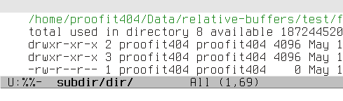
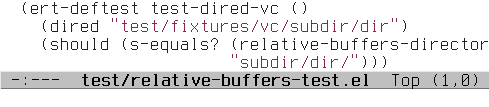

Relative buffers
================

.. image:: https://travis-ci.org/proofit404/relative-buffers.png
    :target: https://travis-ci.org/proofit404/relative-buffers
    :alt: Build Status

Emacs buffers naming convention.

.. figure:: static/python-module.png

Installation
------------

You can install this package from Melpa_::

    M-x package-install RET relative-buffers RET

.. _Melpa: http://melpa.milkbox.net/
