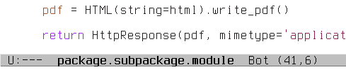

Relative buffers
================

.. image:: https://travis-ci.org/proofit404/relative-buffers.png
    :target: https://travis-ci.org/proofit404/relative-buffers
    :alt: Build Status

.. image:: https://coveralls.io/repos/proofit404/relative-buffers/badge.png
    :target: https://coveralls.io/r/proofit404/relative-buffers
    :alt: Coverage Status

Emacs buffers naming convention.

.. figure:: static/dired.png
.. figure:: static/file-name.png

This is a tiny package that will rename your buffers according to project
structure.  For python buffers that will be whole module name.  For temporary
files and directories that will be relative path from project root.

Installation
------------

You can install this package from Melpa_::

    M-x package-install RET relative-buffers RET

Usage
-----

Drop following line into your .emacs file:

.. code:: lisp

    (global-relative-buffers-mode)

.. _Melpa: http://melpa.milkbox.net/
